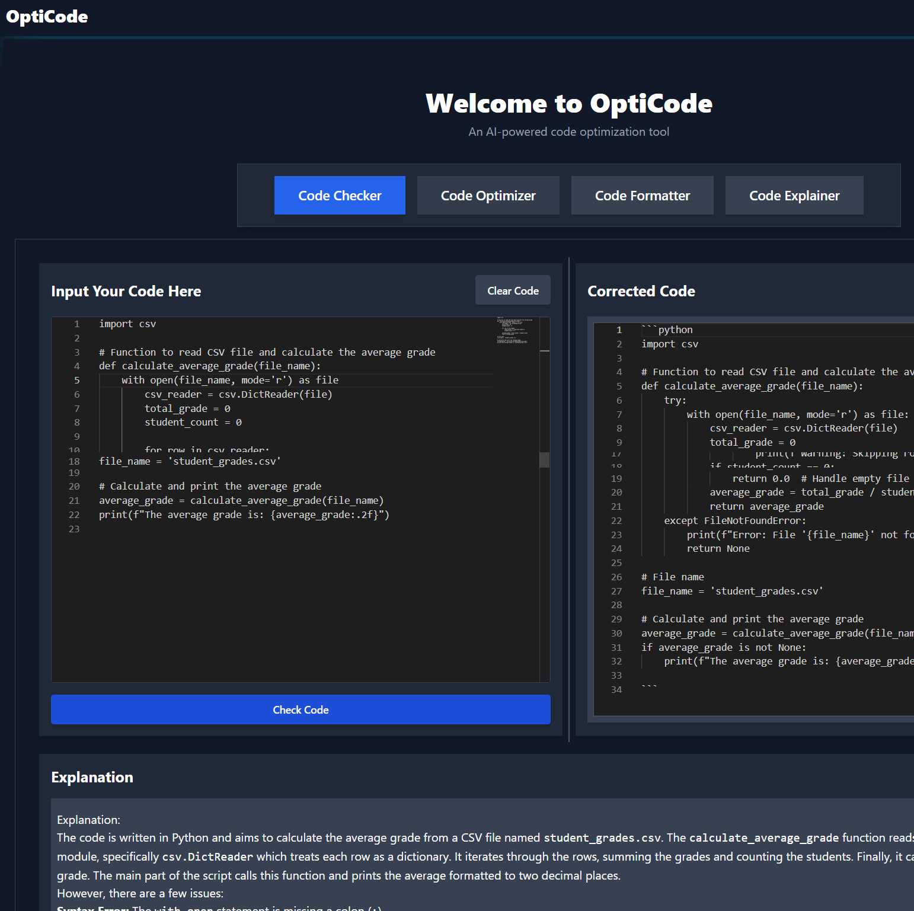
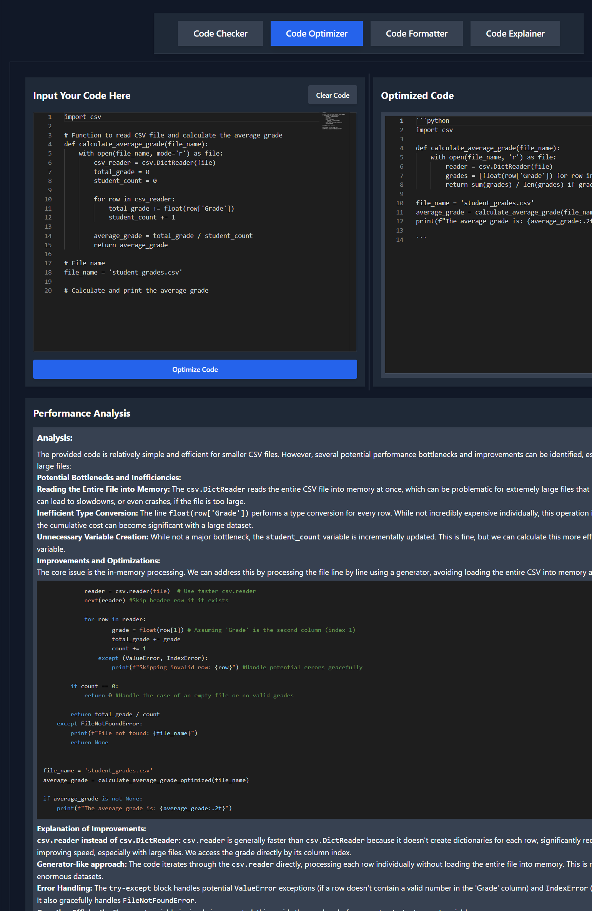
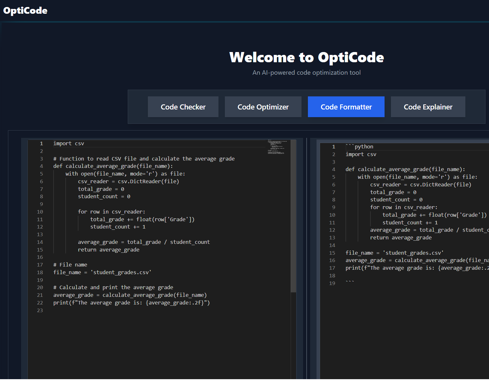
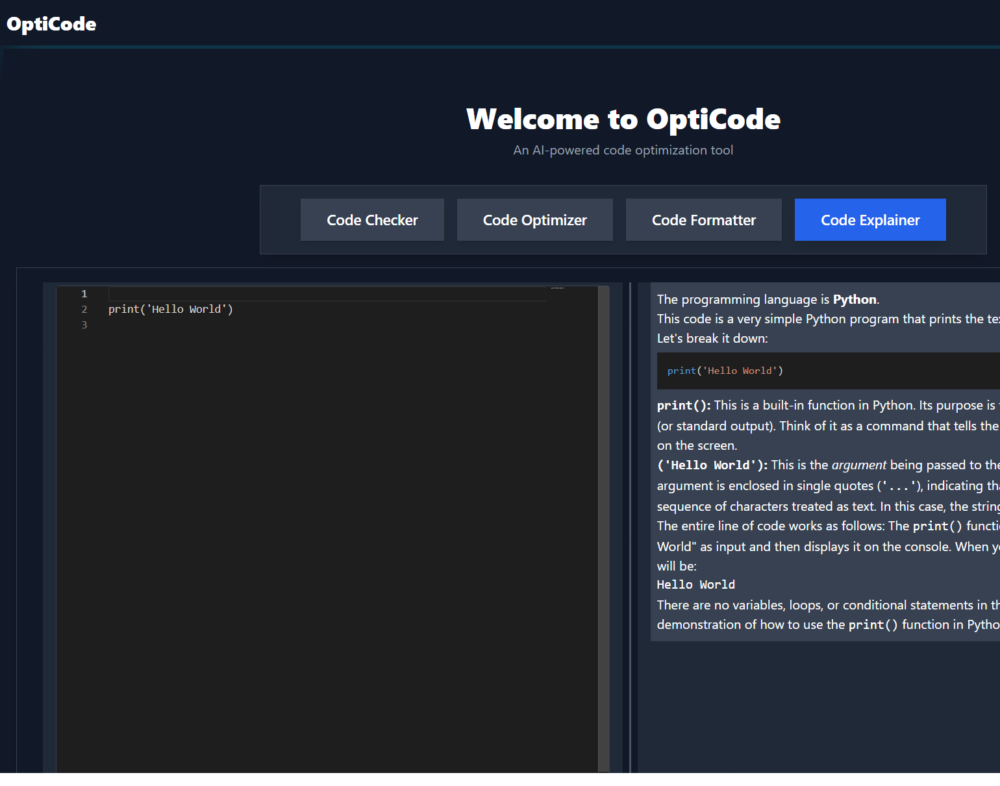

# 🚀 OptiCode

**OptiCode** is an AI-powered coding assistant designed to enhance developer productivity by offering features such as code optimization, error checking, formatting, and explanation. Built using **Next.js (React)** for the frontend and **FastAPI (Python)** for the backend, OptiCode integrates **Gemini AI**, **GPT-4**, and various code analysis tools.

---

## 🌟 Features

✅ **Code Checker** – Identifies syntax errors, security vulnerabilities, and performance issues.  
✅ **Code Optimizer** – Enhances code efficiency and readability.  
✅ **Code Formatter** – Formats code based on best practices and styling rules.  
✅ **Code Explainer** – Breaks down complex code snippets into understandable explanations.  
✅ **Multi-Language Support** – Works with multiple programming languages.  
✅ **Modern UI** – Intuitive and user-friendly interface with Tailwind CSS & ShadCN.

---

## 🛠️ Tech Stack

### **Frontend**
- **Framework:** Next.js (React + TypeScript)
- **Styling:** Tailwind CSS, ShadCN
- **UI Components:** Custom-built with Reusable Components

### **Backend**
- **Framework:** FastAPI (Python)
- **AI Models:** Gemini AI 1.5, GPT-4 API
- **Code Analysis:** Flake8, ESLint, Pylint, Bandit, SonarQube
- **Database:** PostgreSQL
- **WebSockets** for real-time communication

### **DevOps & Deployment**
- **Docker & Kubernetes** for containerization & orchestration
- **AWS Free Tier** (EC2, S3, Lambda) for cloud hosting

---

## 📂 Project Structure

```
OptiCode/
│── backend/
│   ├──__pycache__
│   ├──env/
│   ├── code_checker.py
│   ├── optimizer.py
│   ├── formatter.py
│   ├── explainer.py
│   ├── main.py
│
│── frontend/    # Next.js frontend
│   ├── app/      # Pages & Routes
│   ├── components/ui/  # ShadCN Components
│   ├── public/   # Static assets
│   ├── lib/
│   ├── styles/   # Tailwind Global Styles
│   ├── package.json
│   └── next.config.js
```

---

## 🚀 Getting Started

### **1️⃣ Clone the Repository**
```sh
git clone https://github.com/VyaS-009/OptiCode.git
cd OptiCode
```

### **2️⃣ Backend Setup**
```sh
cd backend
python -m venv env
source env/bin/activate  # On Windows, use 'env\Scripts\activate'
pip install -r requirements.txt
uvicorn main:app --reload
```

### **3️⃣ Frontend Setup**
```sh
cd frontend
npm install
npm run dev
```
The frontend will be available at **http://localhost:3000**.

---

## 📸 Screenshots
### Homepage/code-checker


### Code Optimization Feature


### Code Formatter Feature


### Code Explainer Feature



---

## 📌 Contributing
We welcome contributions! To contribute:
1. Fork the repository 📌
2. Create a new branch (`feature-xyz`) 🌱
3. Commit your changes ✨
4. Push to the branch and submit a PR 🚀

---

## 📄 License
This project is licensed under the **MIT License** – feel free to use and modify it!

---

## 📬 Contact
🔹 **GitHub:** [VyaS-009](https://github.com/VyaS-009)  
🔹 **LinkedIn:** [Your LinkedIn Profile](https://www.linkedin.com/in/vedavyas-viswanatham-3769a2219/)  
🔹 **Email:** vedavyas9990@gmail.com  

---

⭐ If you like this project, don't forget to give it a **star** on GitHub! ⭐

